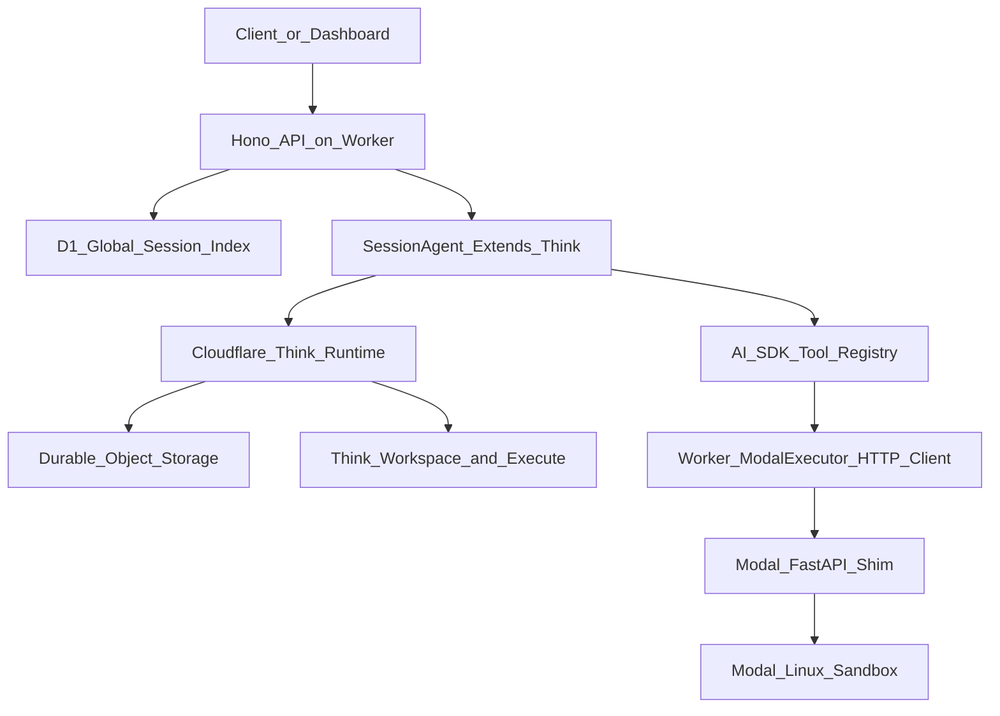

# From-Scratch Agent Harness Implementation Plan

## Starting Point

The repository is currently a minimal pnpm workspace with root tooling only: [`package.json`](package.json), [`pnpm-workspace.yaml`](pnpm-workspace.yaml), [`biome.jsonc`](biome.jsonc), [`lefthook.yml`](lefthook.yml), and no existing `packages/`, TypeScript config, Wrangler config, or Python project. The implementation should therefore scaffold the harness from scratch while preserving the existing Ultracite/Biome conventions.

## Architecture Boundary

Build the harness as a product/control-plane layer, not a replacement agent runtime:

Cloudflare Agents and `@cloudflare/think` own Durable Object lifecycle, named routing, callable methods, chat execution, turn hooks, message persistence, compaction, workspace execution, and recovery behavior. This repo owns D1 indexing, HTTP API policy, schema validation, model dispatch, tool gating, Modal shim integration, and operator inspection.

## Phase 1: Workspace And Contracts

Create the package skeletons under [`packages/`](packages):

- [`packages/shared`](packages/shared): TypeScript package with subpath exports only.
- [`packages/control-plane`](packages/control-plane): Cloudflare Worker, Durable Object agent, Hono router, Drizzle D1 schema, Think integration, tools, Modal client.
- [`packages/modal-shim`](packages/modal-shim): Python Modal/FastAPI app.
- Defer [`packages/dashboard`](packages/dashboard) or [`packages/cli`](packages/cli) until the API and shim smoke tests pass.

Add root TypeScript/workspace config needed by `pnpm typecheck`, keeping root scripts aligned with the existing [`package.json`](package.json) scripts: `check`, `fix`, and `typecheck`.

In [`packages/shared`](packages/shared), implement only stable contracts:

- `src/schemas/primitives.ts`: model providers, reasoning effort, SCM provider, session status, extension policy.
- `src/schemas/session.ts`: repo, compaction, and session config schemas.
- `src/schemas/sandbox.ts`: sandbox providers, sandbox profile shape, exec result schema.
- `src/lib/sandbox-profiles.ts`: shared image profile registry and resolver.
- `src/schemas/api.ts`: session CRUD, inspection, sandbox exec, and typed error schemas.
- `src/lib/base64.ts`: Worker-safe base64 helpers.
- `src/lib/utils.ts`: tiny shared helpers only.

Do not add a root barrel export. Use subpath imports such as `@codebreaker/shared/schemas/session`.

## Phase 2: Control Plane Shell

In [`packages/control-plane`](packages/control-plane), add the Cloudflare Worker foundation:

- `package.json` dependencies: `agents`, `@cloudflare/think`, `@cloudflare/shell`, optional `@cloudflare/codemode`, `ai`, `@ai-sdk/openai`, `@ai-sdk/anthropic`, `hono`, `@hono/zod-validator`, `zod`, `drizzle-orm`, `drizzle-kit`, `wrangler`, and `@cloudflare/workers-types`.
- `wrangler.jsonc` or equivalent Worker config with D1, Durable Object, secrets, compatibility settings, and migrations.
- `src/types.ts`: `Env` bindings for `SESSION_AGENT`, `DB`, `LOADER`, model API keys, JWT secret, and Modal shim URL/secret.
- `src/index.ts`: export `SessionAgent` and route Cloudflare agent requests before falling back to the Hono app.
- `src/router.ts`: Hono `/health` first, then JWT-protected `/sessions/*` and `/admin/*` routes.

Add Drizzle-backed D1 mirror storage:

- `src/db/d1-schema.ts`: `sessions` and `processed_events` tables.
- `src/db/session-index.ts`: `upsert`, `list`, `get`, `setStatus`, `addTokenUsage`, and `incrementTurn` with bounded retry and idempotent event keys.
- Treat D1 as an at-least-once denormalized index only. Do not store Think messages, memory, turn state, or recovery state in D1.

## Phase 3: Think Session Agent

Implement [`packages/control-plane/src/session/agent.ts`](packages/control-plane/src/session/agent.ts) as `SessionAgent extends Think<Env, SessionConfig>`.

Required behavior:

- Override `getModel()`, `getSystemPrompt()`, `getTools()`, and `configureSession()`.
- Use Think context blocks for system prompt and memory.
- Use Think/Agents compaction utilities if available; provide only thresholds and the summarization callback.
- Keep `onStart()` limited to max-turn/session configuration.
- Use `beforeTurn()` for provider-specific options such as OpenAI reasoning effort.
- Mirror lifecycle state from `onStepFinish()`, `onChatResponse()`, `onChatError()`, and `onChatRecovery()` into D1 via `ctx.waitUntil()` and idempotency keys.
- Add callable `init(config)`, `archive()`, and narrow dev/operator inspection methods.

Add [`packages/control-plane/src/session/model.ts`](packages/control-plane/src/session/model.ts) to map session config to OpenAI or Anthropic AI SDK model instances. Fail fast for unsupported providers or missing API keys.

Do not add a custom HTTP chat or stream protocol. Frontend clients should use the Cloudflare Agents/Think chat protocol directly; Hono should remain the control-plane API.

## Phase 4: API And Policy Surface

Implement Hono routes in [`packages/control-plane/src/router.ts`](packages/control-plane/src/router.ts):

- `GET /health`: public liveness.
- `GET /sessions`: list D1 rows with status, limit, offset.
- `GET /sessions/:id`: read D1 row.
- `POST /sessions`: validate config, create D1 row, initialize named Durable Object agent.
- `DELETE /sessions/:id`: call agent `archive()`.
- `GET /sessions/:id/messages`, `/config`, `/state`: operator inspection.
- `GET /sessions/:id/sandbox`, `POST /sessions/:id/sandbox/exec`: operator-only sandbox inspection/exec.
- `GET /admin/shim/health`, `GET /admin/shim/sandboxes`: shim admin.

Add typed error responses from shared schemas, CORS as needed, and JWT middleware for all session/admin endpoints.

Do not expose `POST /sessions/:id/messages` from Hono. User-facing chat, streaming, client tools, and recovery belong to the Cloudflare Agents/Think protocol.

Implement additive tool tiers:

- `READ`, `WRITE_LOCAL`, `EXEC_LOCAL`, `NETWORK`, `EXEC_REMOTE`, `EXPLOIT`.
- Map `readonly`, `workspace`, `local`, `network`, `sandbox`, and `unrestricted` policies to max tiers.
- Materialize only allowed tools before passing them to Think so the model never sees disallowed tools.
- Treat Think execute/codemode as local execution and Modal/recon wrappers as remote execution.
- Keep exploit-tier tools reserved until explicit policy and audit logging exist.

Core files:

- `src/tools/tiers.ts`
- `src/tools/builtins.ts`
- `src/tools/http.ts`
- `src/tools/modal.ts`
- `src/tools/pentest/recon.ts`
- `src/sandbox/modal.ts`

## Phase 5: Modal Shim

Build [`packages/modal-shim`](packages/modal-shim) because Workers should call Modal over HTTPS rather than the Modal Node SDK.

Add [`packages/modal-shim/pyproject.toml`](packages/modal-shim/pyproject.toml) with `modal>=0.67.0`, `fastapi>=0.115.0`, and `pydantic>=2.9.2`.

Expose endpoints:

- `GET /health`: no auth.
- `POST /exec`: buffered execution.
- `POST /exec/stream`: NDJSON streaming execution.
- `POST /read`: base64 file read.
- `POST /write`: base64 file write.
- `POST /terminate`: terminate session sandbox.
- `POST /snapshot`: optional snapshot.
- `GET /sandboxes` and `GET /sandboxes/{session_id}`: admin inspection.

Enforce `X-Shim-Secret` on all non-health endpoints. Support `X-Idempotency-Key` for non-streaming mutating calls.

Use Modal Dicts:

- `codebreaker-sandboxes`: session sandbox metadata, image fingerprint, optional snapshot id.
- `codebreaker-idempotency`: cached responses with TTL.
- `codebreaker-ratelimits`: per-session sliding-window timestamps.

Resolve sandbox profiles from shared schema names. If the requested profile fingerprint changes for a session, terminate the stale sandbox and create a fresh one.

## Phase 6: Worker Modal Executor

Implement [`packages/control-plane/src/sandbox/modal.ts`](packages/control-plane/src/sandbox/modal.ts) as a fetch client:

- Add secret header and idempotency headers.
- Retry idempotent calls with exponential backoff and `Retry-After` support for `429`.
- Stream `/exec/stream` as NDJSON and aggregate into `ExecResult`.
- Cap stdout/stderr for LLM context, for example 256 KiB each.
- Do not retry streaming exec after partial output is observed.
- Make `writeFile` retry-safe.
- Treat `terminate()` as best-effort.

Expose AI SDK tools in [`packages/control-plane/src/tools/modal.ts`](packages/control-plane/src/tools/modal.ts): `exec_remote`, `remote_read`, and `remote_write`. Add recon wrappers only as thin structured command wrappers over `exec_remote`.

## Phase 7: Local Dev, Validation, And Docs

Add local development artifacts after core code exists:

- `.dev.vars.example` with required local variables only.
- D1 migrations and `drizzle-kit` config.
- Wrangler local dev notes.
- Modal deploy/auth notes.
- Production deployment docs covering D1 creation/migration, Worker secrets, Modal secret, deploy order, smoke tests, and secret rotation.

Validation checklist:

- `pnpm typecheck` passes.
- `pnpm dlx ultracite check` passes.
- D1 migrations apply locally and remotely.
- Worker can create a session and initialize the named Durable Object.
- Agent can answer without sandbox configured.
- Policy filtering prevents tools above `extensionPolicy` from being visible.
- Think execute/codemode works when policy allows.
- Modal `exec_remote` can run `uname -a` or `python3 --version` when sandbox policy/profile allows.
- Token and turn counters do not double-count after retries or recovery.
- Archive marks D1 archived and best-effort terminates Modal sandbox.
- Operator/debug endpoints are JWT-protected and clearly marked non-product APIs.

## Key Risks To Resolve During Implementation

- Verify exact current APIs for `agents`, `routeAgentRequest()`, callable RPC, `@cloudflare/think`, compaction hooks, and Think execute/codemode before locking types.
- Confirm Durable Object named-agent lookup and RPC hydration behavior against the installed `agents` version.
- Keep the first pass narrow: no dashboard, no generic SCM abstraction, no custom stream protocol, no custom DO message tables, and no exploit tools.