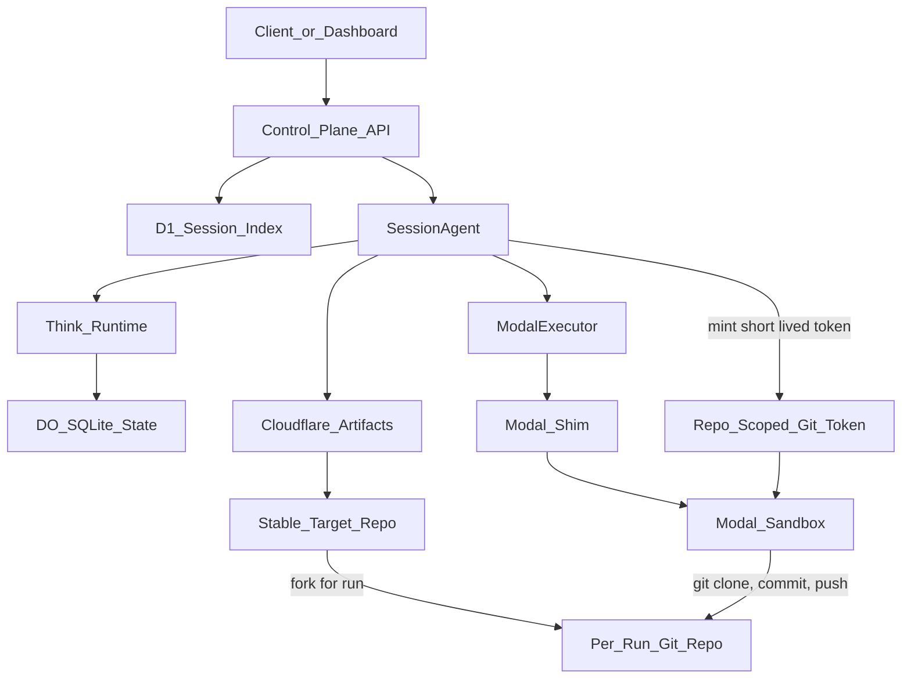

# Artifacts-Backed Benchmark Artifact Plan

## Goal

Move benchmark artifacts from an implicit sandbox-local filesystem model to an explicit Cloudflare Artifacts model. Persistent stable target repos hold open source codebase baselines, every benchmark session gets an isolated durable per-run repo, and sandboxes only check out, execute, commit, and push work against that per-run repo.

## Architecture




## Repository Model

- Maintain persistent stable Artifacts repos for benchmark targets, such as `target-django-cve-xxxx` or `target-express-cve-yyyy`.
- Treat stable target repos as reviewed baselines. Prefer read-only repos once imported and normalized.
- Store target source, vulnerable/patched refs or branches, setup notes, benchmark harness files, and validation criteria in the stable target repo.
- For every benchmark run, fork or create an isolated per-run repo named from stable identifiers such as `run-<benchmarkId>-<sessionId>-<agentId>`.
- Let agents mutate only the per-run repo. They can create exploit files, validation scripts, notes, and evidence without changing the stable baseline.
- Use Artifacts Git history as the durable audit trail for what the agent produced and how the result changed over time.

## Storage Boundaries

- Cloudflare Artifacts is the durable source of truth for benchmark code and work product: stable target repos, per-run working repos, generated exploit files, validation scripts, final reports, evidence files, and git history.
- Modal sandbox storage is scratch execution state. It should clone from Artifacts into `/workspace/<repo>`, run commands, then push commits back.
- Think/Agents state stores orchestration metadata: target repo, per-run repo, remote URL, branch, latest commit SHA, artifact path, run command, status, validation summary, and recovery context.
- D1 remains a denormalized index only: session status, benchmark ID, stable target repo, per-run repo, latest commit SHA, benchmark status, timestamps, token/turn counters.
- Repo-scoped Artifacts tokens are short-lived and minted just in time for specific operations. They should not be persisted in D1 or exposed to the model as long-lived secrets.

## Key Code Areas

- `[packages/control-plane/wrangler.jsonc](packages/control-plane/wrangler.jsonc)`: add the Artifacts binding, likely `ARTIFACTS` in a namespace such as `codebreaker-benchmarks` or `default`.
- `[packages/control-plane/src/types.ts](packages/control-plane/src/types.ts)`: add `ARTIFACTS: Artifacts` to the Worker environment type using Wrangler-generated Cloudflare binding types as the source of truth.
- `[packages/shared/src/schemas/session.ts](packages/shared/src/schemas/session.ts)`: extend session config/metadata with benchmark artifact repo settings if needed, deriving TypeScript types from Zod schemas rather than duplicating interfaces.
- `[packages/shared/src/schemas/api.ts](packages/shared/src/schemas/api.ts)`: add artifact repo metadata to session responses and benchmark inspection endpoints, reusing shared schema-derived types.
- `[packages/control-plane/src/db/d1-schema.ts](packages/control-plane/src/db/d1-schema.ts)` and `[packages/control-plane/src/db/session-index.ts](packages/control-plane/src/db/session-index.ts)`: index Artifacts repo name/id/default branch/latest commit, not file contents or tokens.
- New `packages/control-plane/src/artifacts/repository.ts`: create/import/fork/get stable and per-run repos, mint operation-scoped tokens, normalize repo names, and build authenticated Git command inputs.
- `[packages/control-plane/src/session/agent.ts](packages/control-plane/src/session/agent.ts)`: initialize or attach stable target repo and per-run repo metadata for each benchmark session, then keep the artifact contract in Think session context/state.
- `[packages/control-plane/src/sandbox/modal.ts](packages/control-plane/src/sandbox/modal.ts)` and `[packages/modal-shim/src/codebreaker_modal_shim/runtime.py](packages/modal-shim/src/codebreaker_modal_shim/runtime.py)`: add higher-level checkout/commit/push support or provide safe exec helpers for Git operations.

## Interface And Type Strategy

- Prefer interfaces and types from the underlying libraries over hand-rolled duplicates.
- Treat Wrangler-generated `Artifacts` binding types as the authority for repo handles, repo metadata, token return shapes, and method signatures.
- Use SDK types from `agents`, `@cloudflare/think`, `@cloudflare/shell`, `ai`, and Cloudflare Workers where available.
- In shared packages, define wire contracts with Zod and export types via `z.infer`.
- Local interfaces should be thin domain wrappers only when they add benchmark-specific meaning, such as mapping a library repo handle into a persisted `BenchmarkArtifactState`.
- Avoid copying Cloudflare API response shapes manually unless Wrangler-generated types are unavailable. If a manual type is necessary, keep it private to the adapter and validate at the boundary.

## Artifact Contract

Represent the durable benchmark work product as structured session context, roughly:

```ts
type BenchmarkArtifactState = {
  targetRepoName: string;
  targetRepoRemote: string;
  runRepoName: string;
  runRepoRemote: string;
  defaultBranch: string;
  workingBranch: string;
  latestCommitSha?: string;
  artifactPath?: string;
  runCommand?: string;
  status: "pending" | "draft" | "validated" | "failed";
  vulnerableEvidencePath?: string;
  patchedEvidencePath?: string;
};
```

The file paths point into the Artifacts repo checkout, not arbitrary sandbox-local paths.

Recommended per-run repo layout:

```text
/target/                 # target source or normalized benchmark fixture
/artifacts/              # agent-created exploit and supporting files
/evidence/               # vulnerable and patched run outputs
/reports/                # human-readable summaries
/benchmark.json          # machine-readable final benchmark result
```

## Session Flow

1. Benchmark target onboarding imports or creates a stable Artifacts repo for the open source target codebase and harness files.
2. Session creation validates benchmark target config, resolves the stable target repo, and provisions a per-run fork or copy for the specific agent/session.
3. The agent stores target repo and run repo metadata in Think state/context and mirrors indexable fields into D1.
4. Before sandbox checkout, the control plane mints a short-lived read or write token for the per-run repo and sends the remote/token to Modal only for that operation.
5. Modal clones or updates `/workspace/<runRepoName>` using the token.
6. The agent inspects source and produces or edits exploit artifacts in that checkout through sandbox Git operations.
7. Validation runs in the sandbox against vulnerable/patched target states.
8. Evidence files and generated artifacts are committed and pushed to the per-run Artifacts repo.
9. The agent records the final commit SHA, artifact path, run command, and validation summary in Think context and D1 index fields.

## Token Lifecycle For Long-Running Agents

- The durable object is the Artifacts repo, not the Git token.
- Long-running agents should persist repo names, remotes, branch names, and commit SHAs, then request fresh tokens only when they need Git access.
- Use read tokens for clone/fetch/review windows and write tokens for commit/push windows.
- Prefer short TTLs by operation: roughly 15-60 minutes for clone/fetch, 5-15 minutes for push-only windows, and longer hour-scale tokens only when an active sandbox genuinely needs continuous Git access.
- If a token expires during a long run, the agent should ask the control plane to mint a new token and retry the Git operation.
- Tokens must not be written into Artifacts repos, Think context, D1 rows, model-visible prompts, or persistent logs.

## Security And Token Handling

- Mint read tokens for clone/review and write tokens only for commit/push windows.
- Prefer `git -c http.extraHeader="Authorization: Bearer <token>" ...` over storing credentials in remotes.
- Avoid including tokens in model-visible messages, logs, D1 rows, or persisted session context.
- Keep operator endpoints JWT-protected when exposing repo metadata or token minting actions.

## Migration From Current Plan

- Replace “artifact file path in Modal sandbox” with “artifact file path in an Artifacts repo checkout.”
- Add stable target repos and per-agent/per-run repos as first-class concepts.
- Keep Modal sandbox as the execution engine, but make it disposable and reconstructable from Artifacts state.
- Keep Think workspace for small agent-local notes only; do not use it as the canonical benchmark code store.
- Keep D1 as an index, not a file or evidence store.

todos:

- model-target-baselines: Model persistent stable target repositories and per-agent/per-run working forks.
- add-artifacts-binding: Add Cloudflare Artifacts binding and Env typing.
- define-artifact-contract: Add shared schemas for benchmark artifact repo state and validation evidence metadata, deriving interfaces from Cloudflare/Artifacts and shared library types where possible.
- add-artifacts-service: Implement Worker-side repo create/import/fork/get and just-in-time short-lived token minting.
- index-artifacts-metadata: Extend D1 schema/store to mirror repo name/id/branch/latest commit/status.
- initialize-session-repo: Provision or attach a per-run Artifacts repo from a stable target baseline during session creation/init.
- wire-sandbox-git: Add Modal-side clone/update/commit/push workflow using operation-scoped repo tokens.
- persist-final-state: Record final artifact path, run command, commit SHA, and evidence summary in agent context and D1.
- document-benchmark-flow: Update docs with the storage boundaries, token flow, and rerun/reproduce procedure.

