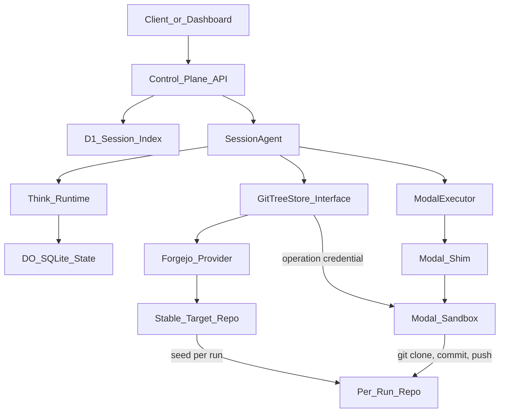

# Forgejo-Backed Git Artifact System Plan

## Goal

Add a provider-neutral Git-backed file tree layer, using Forgejo as the first concrete backend. The benchmark architecture should behave like Cloudflare Artifacts: stable target repositories, isolated per-run repositories, standard Git clone/push from sandboxes, and durable repo metadata in agent state and D1.

Cloudflare Artifacts remains the target future provider, but the current implementation should not require Artifacts account access.

## Current Repo Baseline

This plan starts from the current codebase state:

- There is no Cloudflare Artifacts binding in `packages/control-plane/wrangler.jsonc`.
- `packages/control-plane/src/types.ts` only has core Worker, D1, Agent, Modal, CORS, and model env bindings.
- There is no `packages/control-plane/src/artifacts/` directory yet.
- There is no shared benchmark/artifact schema yet; `packages/shared/src/schemas/session.ts` only has optional `repo` metadata and optional `sandbox`.
- D1 currently indexes only `repo_owner` and `repo_name`; it does not track target repo, run repo, provider, branch, commit SHA, artifact path, evidence paths, or benchmark status.
- `SessionAgentState` currently stores only `sessionId` and `status`.
- `packages/control-plane/src/router.ts` has session CRUD/inspection plus sandbox inspect/exec endpoints, but no artifact endpoints.
- `packages/control-plane/src/sandbox/modal.ts` supports remote exec/read/write/terminate only; there is no Git checkout/commit/push helper yet.
- `packages/modal-shim` exposes exec/read/write/terminate/snapshot/sandbox inspection, but no Git-specific routes.
- `docs/artifacts-benchmark-flow.md` does not exist yet.

The implementation should therefore add the Git artifact layer from scratch rather than refactor an existing Artifacts provider.

## Forgejo Fit

Forgejo gives us the pieces we need from its documented API surface:

- API authentication supports `Authorization: token ...` and `Authorization: Bearer ...`.
- API tokens can be created with `POST /api/v1/users/:name/tokens`, authenticated with Basic Auth.
- Access tokens require scopes. For this system, use `read:repository`, `write:repository`, and, for org management if needed, `write:organization`.
- The OpenAPI document is available at `/swagger.v1.json`; generated types should be preferred over hand-written response shapes.
- The Swagger UI is available at `/api/swagger`, which should be treated as the exact API reference for the deployed Forgejo major version.
- Repository migration/import is available through `/api/v1/repos/migrate` for bootstrapping stable target repos from upstream Git remotes.

## Storage Model

With Forgejo, Git repositories are stored as normal bare repositories in Forgejo's configured repository storage, usually a persistent Docker volume or server filesystem under Forgejo's data directory. Forgejo metadata, users, orgs, tokens, repo settings, and permissions live in its configured database.

The Modal sandbox never owns canonical storage. It gets a working checkout:

```text
Forgejo bare repo storage
  -> standard Git remote
  -> Modal checkout at /workspace/<runRepoName>
  -> commit and push back to Forgejo
```

## Architecture



## Provider Interface

Add a provider-neutral abstraction so Forgejo can be swapped for Cloudflare Artifacts later:

```ts
interface GitTreeStore {
  ensureStableTarget(input: EnsureStableTargetInput): Promise<GitRepoRef>;
  createRunRepo(input: CreateRunRepoInput): Promise<GitRepoRef>;
  mintCredential(input: MintGitCredentialInput): Promise<GitCredential>;
  archiveRunRepo(input: ArchiveRunRepoInput): Promise<void>;
}

type GitRepoRef = {
  cloneUrl: string;
  defaultBranch: string;
  fullName: string;
  htmlUrl?: string;
  name: string;
  provider: "forgejo" | "cloudflare-artifacts";
};

type GitCredential = {
  password: string;
  type: "basic" | "token-header";
  username: string;
};
```

Prefer interfaces derived from generated Forgejo OpenAPI types. If generated types are not available in the first pass, keep manual Forgejo DTOs private to the provider adapter and validate provider outputs at the boundary.

Because the current repo already uses shared Zod contracts, add provider-neutral schemas first and derive exported TypeScript types with `z.infer`.

## Repository Model

- Maintain persistent stable target repos in Forgejo, for example `target-django-cve-xxxx` or an org/repo pair such as `targets/django-cve-xxxx`.
- Treat stable target repos as reviewed baselines. They should be private and only mutated by control-plane onboarding jobs.
- Bootstrap stable repos with `/api/v1/repos/migrate` from public or authenticated upstream Git remotes.
- Create one isolated per-run repo for each benchmark session or agent run, for example `run-<benchmarkId>-<sessionId>-<agentId>`.
- Agents only mutate per-run repos.
- Store generated exploit artifacts, validation scripts, reports, and evidence in the per-run repo.
- Record final commit SHA, artifact paths, run command, and validation status in Think state and D1.

## Token And Credential Strategy

Forgejo does not match Cloudflare Artifacts' repo-token model exactly. Use a service account model first:

- Create a Forgejo service user or bot for the control plane.
- Store its API token or Basic Auth credentials as Worker secrets.
- Use scoped tokens with `write:repository` for repository lifecycle and `read:repository` for read-only operations where possible.
- For Git clone/push, pass credentials to Modal only for the operation window.
- Prefer Git's `http.extraHeader` when practical. If Forgejo requires Basic Auth for Git HTTPS, construct an authenticated remote in process memory or environment variables only and avoid persisting credentials in remotes.
- Never persist Forgejo tokens in D1, Think context, model-visible messages, or pushed files.

If Forgejo v15 repo-specific tokens are available in the deployed setup, prefer specific-repository tokens for per-run repo clone/push operations. Otherwise, use the service account token and rely on the sandbox trust boundary plus secret hygiene.

## Session Flow

1. Session creation validates `config.benchmark`.
2. The control plane resolves or creates the stable target repo through `GitTreeStore.ensureStableTarget`.
3. The control plane creates a per-run repo through `GitTreeStore.createRunRepo`.
4. Since Forgejo's API surface is not the same as Artifacts' fork API, implement per-run repo creation as create-then-seed: create the run repo, clone/fetch the stable repo in a controlled setup step, then push to the run repo.
5. The agent stores provider-neutral `BenchmarkArtifactState`: provider, target repo, run repo, branch, commit SHA, artifact path, run command, evidence paths, and status.
6. Before sandbox checkout, the control plane mints or retrieves an operation credential.
7. Modal clones or updates `/workspace/<runRepoName>`.
8. The agent writes exploit artifacts and evidence inside that checkout.
9. Modal commits and pushes results to Forgejo.
10. The control plane updates agent state and D1 with latest commit SHA and artifact status.

## Implementation Scope

- Add `GitTreeStore` from scratch; do not depend on Cloudflare Artifacts.
- Add `ForgejoGitTreeStore` as the first provider.
- Add Forgejo environment variables/secrets:
  - `GIT_TREE_PROVIDER=forgejo`
  - `FORGEJO_BASE_URL`
  - `FORGEJO_TOKEN`
  - Optional `FORGEJO_USERNAME` / `FORGEJO_PASSWORD` only if token creation through `/users/:name/tokens` is required.
  - `FORGEJO_OWNER` or `FORGEJO_ORG`
- Add Modal Git checkout/commit/push routes and corresponding Worker `ModalExecutor` methods.
- Add provider-neutral shared schemas for benchmark target config, run repo config, artifact state, checkout result, commit result, and state update requests.
- Keep Cloudflare Artifacts as a future provider behind the same interface.

## Key Code Areas

- New `packages/shared/src/schemas/artifacts.ts`: provider-neutral Git artifact schemas.
- `packages/shared/src/schemas/session.ts`: add optional `benchmark` config.
- `packages/shared/src/schemas/api.ts`: add artifact state, checkout, commit, and update schemas/responses.
- `packages/shared/package.json`: export the new schemas subpath.
- New `packages/control-plane/src/artifacts/repository.ts`: `GitTreeStore` interface, provider selection, repo-name normalization, and shared provider types.
- New `packages/control-plane/src/artifacts/forgejo.ts`: Forgejo API adapter using generated or validated API types.
- `packages/control-plane/package.json`: export the artifacts modules.
- `packages/control-plane/src/types.ts`: add Forgejo provider env vars; do not add a required Artifacts binding.
- `packages/control-plane/.dev.vars.example`: document Forgejo env vars.
- `packages/control-plane/wrangler.jsonc`: no Artifacts binding until access exists; only Worker secrets/env names are needed.
- `packages/control-plane/src/db/d1-schema.ts`, `packages/control-plane/src/db/session-index.ts`, and a new migration: index provider, benchmark ID, target repo, run repo, branch, latest commit SHA, artifact path, run command, evidence paths, and artifact status.
- `packages/control-plane/src/session/agent.ts`: extend state with artifact metadata, expose callable update/inspection, and add a Think context block for artifact state.
- `packages/control-plane/src/router.ts`: provision repos on session creation when benchmark config exists; add artifact inspect/update/checkout/commit endpoints; depend on `GitTreeStore`, not Cloudflare Artifacts.
- `packages/control-plane/src/sandbox/modal.ts`: add provider-neutral Git checkout/commit/push client methods.
- `packages/modal-shim/src/codebreaker_modal_shim/schemas.py`: add Git checkout/commit request/response schemas.
- `packages/modal-shim/src/codebreaker_modal_shim/main.py`: add authenticated Git checkout/commit routes.
- `packages/modal-shim/src/codebreaker_modal_shim/runtime.py`: implement checkout/commit/push with standard Git commands; do not encode Forgejo-specific assumptions beyond standard Git HTTPS credentials.
- `apps/dashboard/src/lib/api.ts`, `apps/dashboard/src/hooks/queries.ts`, `apps/dashboard/src/hooks/mutations.ts`, and `apps/dashboard/src/lib/query-keys.ts`: add typed artifact API client hooks.
- New `docs/artifacts-benchmark-flow.md`: document provider-neutral Git-backed artifact storage, with Forgejo as the active provider.

## Validation

- `pnpm typecheck`
- `pnpm dlx ultracite check`
- Create a benchmark session with Forgejo config.
- Verify stable target repo is migrated or reused.
- Verify per-run repo is created and clone URL is recorded.
- Verify Modal can clone the per-run repo.
- Verify Modal can commit and push generated files.
- Verify D1 and Think state record run repo, commit SHA, artifact path, and status.

## Future Cloudflare Artifacts Swap

When Cloudflare Artifacts access is available, add `CloudflareArtifactsGitTreeStore` behind the same interface. The session, sandbox, D1, and dashboard flows should not need architectural changes.
