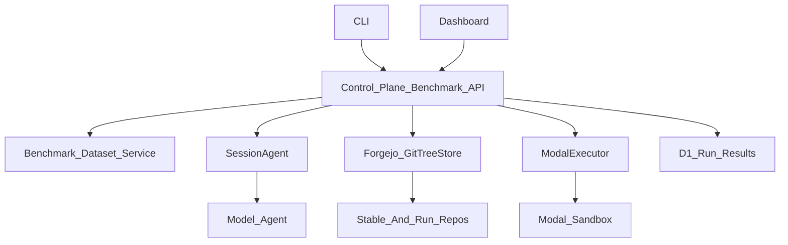

# End-To-End Benchmark Run Plan

## Target UX

The control plane becomes the source of truth for benchmark runs. Users can start, observe, score, and clean up runs through both a dashboard flow and a CLI flow, with both clients calling the same API contracts.

## Shared Core

Create shared benchmark-run contracts so the API, CLI, and dashboard stay aligned:

- Extend [`packages/benchmark-runner/src/schemas.ts`](packages/benchmark-runner/src/schemas.ts) with run request, run state, scoring, result, cleanup policy, and event schemas.
- Keep dataset loading and task rendering in [`packages/benchmark-runner/src/loaders.ts`](packages/benchmark-runner/src/loaders.ts), but add helpers that map a task record into the existing `SessionConfig.benchmark` shape.
- Add a small shared API client package or reusable module so the dashboard and CLI call the same typed benchmark-run endpoints instead of duplicating fetch logic.

## Control Plane Orchestration

Add benchmark-run APIs to [`packages/control-plane/src/router.ts`](packages/control-plane/src/router.ts):

- `GET /benchmark-tasks` to list available tasks and difficulty options.
- `POST /benchmark-runs` to create a run from `{ taskId, difficulty, model, cleanupPolicy }`.
- `GET /benchmark-runs/:id` to inspect run state, linked session, artifact state, score, and logs.
- `POST /benchmark-runs/:id/start` or automatic start on create, depending on UX preference.
- `POST /benchmark-runs/:id/cancel` and `POST /benchmark-runs/:id/cleanup` for explicit lifecycle control.

Add a `BenchmarkRunOrchestrator` under `packages/control-plane/src/benchmarks/` that performs the actual workflow:

1. Load task + metadata using benchmark-runner helpers.
2. Convert task codebase data into `config.benchmark.target.sourceUrl`, vulnerable commit/ref, patched commit/ref, and working branch.
3. Create the session through existing session initialization logic.
4. Checkout the run repo into Modal using existing artifact checkout support.
5. Send the rendered agent input as the initial prompt/message.
6. Monitor session completion or timeout.
7. Parse the agent output into `AgentOutputSchema`.
8. Score against ground truth.
9. Commit evidence and result files to the run repo.
10. Record final state in D1 and optionally clean up sandbox/repo.

## Persistence

Add D1 tables and migrations for benchmark runs, separate from the existing session index:

- `benchmark_runs`: run id, task id, difficulty, status, model, session id, artifact commit SHA, started/completed timestamps, cleanup status.
- `benchmark_run_events`: append-only lifecycle log for UI/CLI progress.
- `benchmark_run_results`: parsed agent output, score, verdict, error details, and artifact paths.

Keep `sessions` as the operational agent index and link benchmark runs to sessions through `session_id`.

## Git And Sandbox Fixes

Tighten the artifact layer so benchmark tasks are reproducible:

- Make checkout support an exact commit SHA, not only a branch, in [`packages/control-plane/src/sandbox/modal.ts`](packages/control-plane/src/sandbox/modal.ts) and [`packages/modal-shim/src/codebreaker_modal_shim/runtime.py`](packages/modal-shim/src/codebreaker_modal_shim/runtime.py).
- Ensure stable target repos are bootstrapped from `task.codebase.repo` and preserve both vulnerable and patched refs from metadata.
- Add cleanup wiring: archiving a benchmark run should terminate the Modal sandbox and archive the per-run Forgejo repo through [`packages/control-plane/src/artifacts/repository.ts`](packages/control-plane/src/artifacts/repository.ts).

## CLI

Add a real CLI entrypoint in `packages/benchmark-runner`:

- `benchmark-runner list` calls `GET /benchmark-tasks`.
- `benchmark-runner run --task <id> --difficulty L1 --model <model>` calls `POST /benchmark-runs` and streams/polls events.
- `benchmark-runner inspect <runId>` prints status, score, artifact commit, and session id.
- `benchmark-runner cleanup <runId>` calls the cleanup endpoint.

The CLI should not duplicate orchestration. It should use shared request/response schemas and the same API client used by the dashboard.

## Dashboard

Add benchmark UI next to the existing sessions UI:

- Task browser backed by `GET /benchmark-tasks`.
- Run creation form with task, difficulty, model, and cleanup policy.
- Run detail page showing lifecycle status, linked session, chat, sandbox, artifacts, events, score, and result JSON.
- Run actions for cancel, retry, and cleanup.

Build this on the existing React Query patterns in [`apps/dashboard/src/hooks/queries.ts`](apps/dashboard/src/hooks/queries.ts), [`apps/dashboard/src/hooks/mutations.ts`](apps/dashboard/src/hooks/mutations.ts), and [`apps/dashboard/src/lib/query-keys.ts`](apps/dashboard/src/lib/query-keys.ts).

## Validation Path

Start with one golden end-to-end task before batch execution:

- Seed or add the expected `benchmark/data/tasks.jsonl` and `benchmark/internal/metadata.jsonl` dataset location.
- Validate fixture loading with the existing `validate:fixtures` script.
- Run one benchmark through the control-plane API.
- Confirm Modal checks out the exact vulnerable commit.
- Confirm the agent receives the rendered `AgentInput`.
- Confirm result parsing/scoring writes D1 rows.
- Confirm artifacts are committed to Forgejo.
- Confirm cleanup terminates Modal and archives the run repo.

## Non-Goals For First Pass

- Batch scheduling and parallel run management.
- Advanced scoring beyond schema validity and ground-truth comparison.
- Multi-provider GitTreeStore beyond the existing Forgejo provider.
- Full dashboard analytics; focus first on run control and observability.